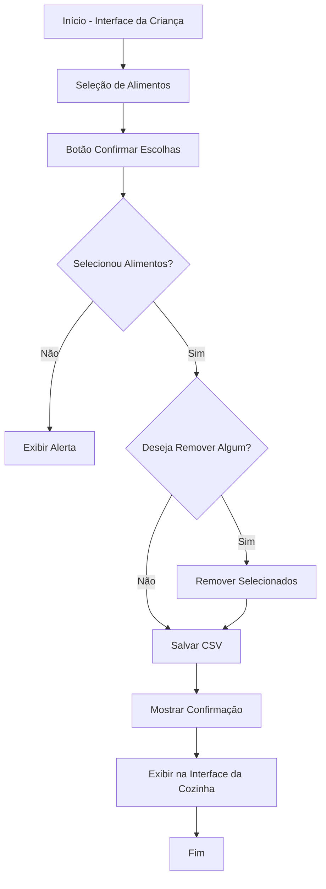
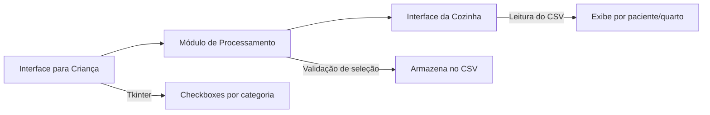

# 🥗 NutriSabará – Sistema Interativo de Escolha de Refeições Hospitalares

## 📌 Descrição do Projeto

**NutriSabará** é um sistema voltado para hospitais pediátricos, com duas interfaces principais:

1. 👧 **Interface para Crianças**: permite que os pequenos escolham suas refeições de forma lúdica e acessível por meio de uma interface gráfica com categorias, emojis e botões intuitivos.

2. 👨‍🍳 **Interface para a Cozinha**: mostra de forma clara todas as refeições escolhidas pelas crianças, facilitando a organização, o preparo e o controle da alimentação hospitalar.

O projeto visa humanizar o momento das refeições no hospital e tornar a nutrição mais participativa e eficiente.

---

## 🎯 Objetivos

- Tornar o processo de seleção de alimentos mais amigável para crianças hospitalizadas.
- Coletar dados estruturados para a equipe da cozinha e nutricionistas.
- Otimizar o preparo das refeições com base nas escolhas feitas pelas crianças.
- Registrar histórico alimentar com data e hora.

---

## 🧰 Tecnologias Utilizadas

| Ferramenta | Finalidade |
|------------|------------|
| Python     | Lógica principal do sistema |
| Tkinter    | Criação das interfaces gráficas |
| CSV        | Armazenamento local das escolhas |
| Datetime   | Registro de data/hora |

---

## 🖼️ Interfaces do Sistema

### 👧 Interface para Crianças

- Três categorias com checkboxes:
  - **Proteínas 🍖**
  - **Acompanhamentos 🍚**
  - **Sobremesas 🍓**
- Design com cores vibrantes, emojis e textos grandes.
- Botão "Confirmar Escolhas" que salva as seleções e pergunta se deseja remover algo antes.
- Mensagem final exibindo a lista de alimentos escolhidos.

### 👨‍🍳 Interface da Cozinha 

- Leitura e visualização do arquivo `refeicoes.csv`.
- Exibição das escolhas por paciente, com nome, número do quarto, data, hora e lista de alimentos.
- Ideal para ser usada em desktop ou tablet na cozinha do hospital.

---

## ✅ Funcionalidades Implementadas

- ✅ Interface interativa com checkboxes por alimento
- ✅ Registro de escolhas com data e hora
- ✅ Salvamento automático em `refeicoes.csv`
- ✅ Confirmação visual e opção de remoção de itens antes do envio
- 🚧 Interface da cozinha para visualização e preparação das refeições

---

## 💾 Exemplo de Linha no Arquivo CSV

```csv
Paciente,001,2025-04-30,15:42:10,Frango Grelhado 🍗; Arroz 🍚; Pudim 🍮
```

---

## 📊 Diagrama de Fluxo


---

## 🧱 Diagrama de Arquitetura



## 📁 Estrutura de Arquivos
```bash
nutrisabara/
├── interface_paciente.py        # Interface da criança
├── interface_cozinha.py            # Interface da cozinha 
├── refeicoes.csv         # Repositório local das escolhas feitas
└── README.md             # Documentação do projeto
```

## 👩‍💻 Desenvolvido por

Projeto desenvolvido com foco em acessibilidade infantil e integração hospitalar no contexto de Engenharia de Software.
Participantes:
- Giovanni Romano Provazi
- Vitor de Lima Domingues
- João Pedro Vieira de Morais


